# Advanced Lane Finding Project

The goals / steps of this project are the following:

* Compute the camera calibration matrix and distortion coefficients given a set of chessboard images.
* Apply a distortion correction to raw images.
* Use color transforms, gradients, etc., to create a thresholded binary image.
* Apply a perspective transform to rectify binary image ("birds-eye view").
* Detect lane pixels and fit to find the lane boundary.
* Determine the curvature of the lane and vehicle position with respect to center.
* Warp the detected lane boundaries back onto the original image.
* Output visual display of the lane boundaries and numerical estimation of lane curvature and vehicle position.

### Camera Calibration

The code for this step is contained in the third and fourth code cell in lines 42 through 72 of the file called FindLanes.py.

I start by preparing "object points", which will be the (x, y, z) coordinates of the chessboard corners in the world. Here I am assuming the chessboard is fixed on the (x, y) plane at z=0, such that the object points are the same for each calibration image.  Thus, `objp` is just a replicated array of coordinates, and `objpoints` will be appended with a copy of it every time I successfully detect all chessboard corners in a test image.  `imgpoints` will be appended with the (x, y) pixel position of each of the corners in the image plane with each successful chessboard detection.  

I then used the output `objpoints` and `imgpoints` to compute the camera calibration and distortion coefficients using the `cv2.calibrateCamera()` function.  I applied this distortion correction to the test image using the `cv2.undistort()` function and obtained this result: 

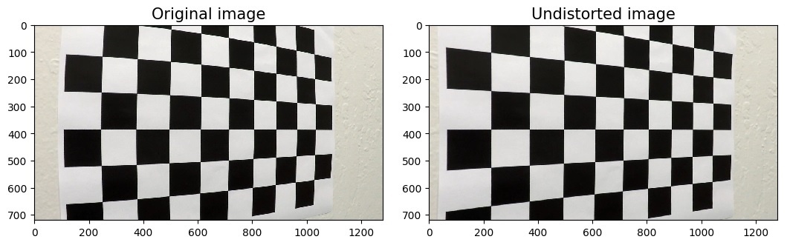

### Pipeline (single images)

#### 1. Distortion correction

Similarly, like in previous step, I used `objpoints` and `imgpoints` to undistort one of the test images. The result can be seen below:
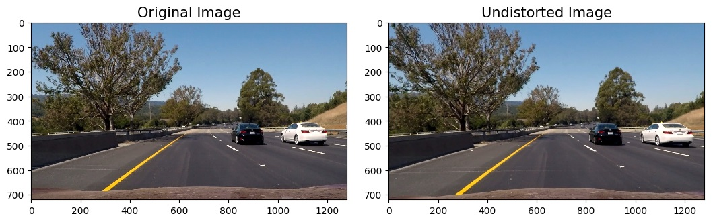

#### 2. Create a thresholded binary image.
I used a combination of gradient and color thresholds to generate a binary image (thresholding steps at lines 99 through 188 in `FindLanes.py`). 

After Gaussian blur and grayscaling I computed Sobel gradients in x and y directions. Below, binary outputs after filtering these gradients in certain ranges (x direction thresholds - (30, 255), y direction thresholds - (150, 255))

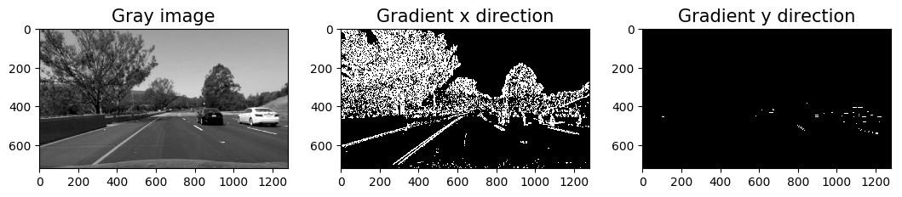

I also produced binary images derived from filtering Sobel gradient magnitude and direction (magnitude threshold - (30, 255), direction threshold - (.7, 1.3)). Then, I decided that, for the final result, good combination of gradient filters would be a logical AND of *x direction*, *magnitude* and *directional* gradient.

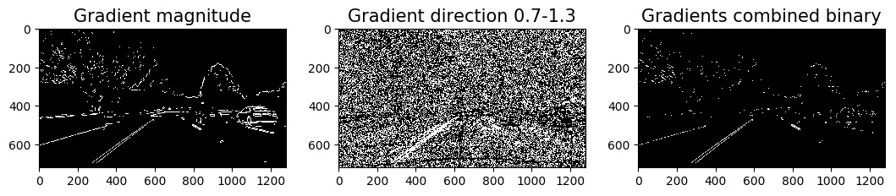

Let's see how the example image looks after dividing it into 3 channels from HSL color space.

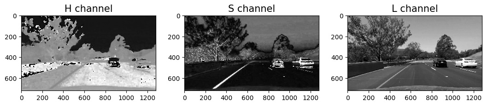

H and S components seem to be attractive for color filtering. Below, you can see filtering of these components in thresholds (15, 45) for H channel, (150, 255) for S channel, and (240, 255) for L channel. H and S filters detect yellow lines fairly well while L channel can be used for deriving white lanes.

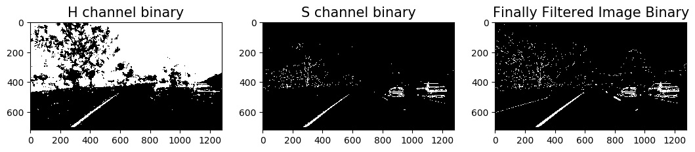

Finally I decided to use all H, S, L channels and to perform logical OR on them and previously calculated gradient binary image. Below, there is the final output of binary thresholded image.

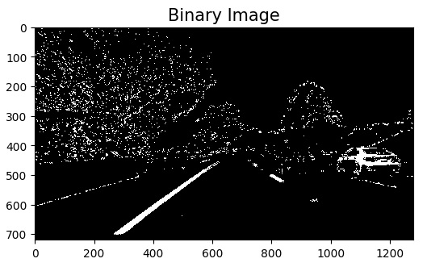

#### 3. Perspective transform.

The code for my perspective transform includes a function called `perspective_transform()`, which appears in lines 80 through 93 in the file `FindLanes.py`. I chose the hardcode the source (`src`) and destination (`dst`) points inside this funcion in the following manner:

```python
height =  img.shape[0]
y_level = 0.64 * height
top_offset = 100
side_offset = 250

src = np.float32(
    [[575, y_level],
    [710, y_level],
    [1130, height],
    [210, height]])
dst = np.float32(
    [[side_offset, top_offset], 
    [1280-side_offset, top_offset],
    [1280-side_offset, height],
    [side_offset, height]])
```

This resulted in the following source and destination points:

| Source        | Destination   | 
|:-------------:|:-------------:| 
| 575, 461      | 250, 100      | 
| 710, 461      | 1030, 100     |
| 1130, 720     | 1030, 720     |
| 210, 720      | 250, 720      |

I verified that my perspective transform was working as expected by drawing the `src` onto the image with straight lines and its warped counterpart. We can see that the lines appear parallel in the warped image and that they are parallel to the lanes.

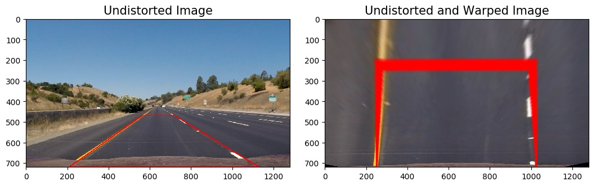

Below, there is an example of the test image and perspective transform using the same `src` and `dst` points.


We can see that the distances between transformed lanes are more or less the same as well as the curvature, so this may confirm the correctness of the perspective transform.

#### 4. Lane-line pixels identification and polynomial fit.

To compute the polynomial fit of the left and right lane we should firstly obtain warped image our thresholded binary image.

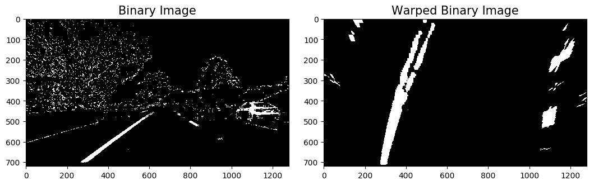

Now, the `fit_lanes()` function is called (in lines 222 through 325 in the file `FindLanes.py`). Firstly, we take a histogram along all the columns in the lower half of the image. The two highest peaks in this histogram will be good indicators of the x-position of the base of the lane lines. From that point, I can use a sliding window, placed around the line centers, to find and follow the lines up to the top of the frame.
The output of this operation is below. Boxes indicate regions where lane pixels were found in the corresponding sliding window.

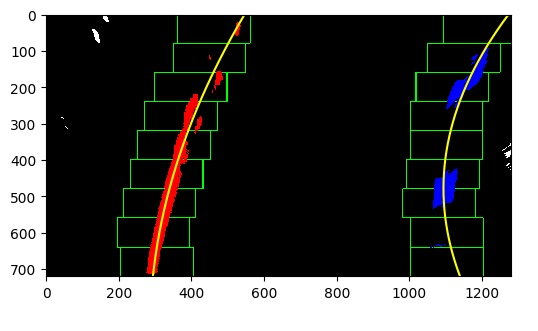

#### 5. Curvature calculation and vehicle position.

The curvature radius is computed by the `calc_curvature_and_return_final_img()` function in lines 492 through 525 in the file `FindLanes.py`. For a second order polynomial f(y)=A y^2 +B y + C the radius of curvature is given by R = [(1+(2 Ay +B)^2 )^3/2]/|2A|. Then, to convert this result to the real world space I defined conversions assigning:
30/720 meters per pixel in y dimension and
3.7/700 meters per pixel in x dimension

The distance from the center of the lane is computed in lines 509 through 511 in the file `FindLanes.py`. It computes the distance from the center of the image to the center of lane lines at the bottom of the picture - using previously found poynomial fit lines.

#### 6. Plotting the projection back on the original image.

I implemented this step in lines 514 through 535 in my code in `FindLanes.py`. Here is a set of results of processing test images (undistorted image, transofrmed, lines projected back):

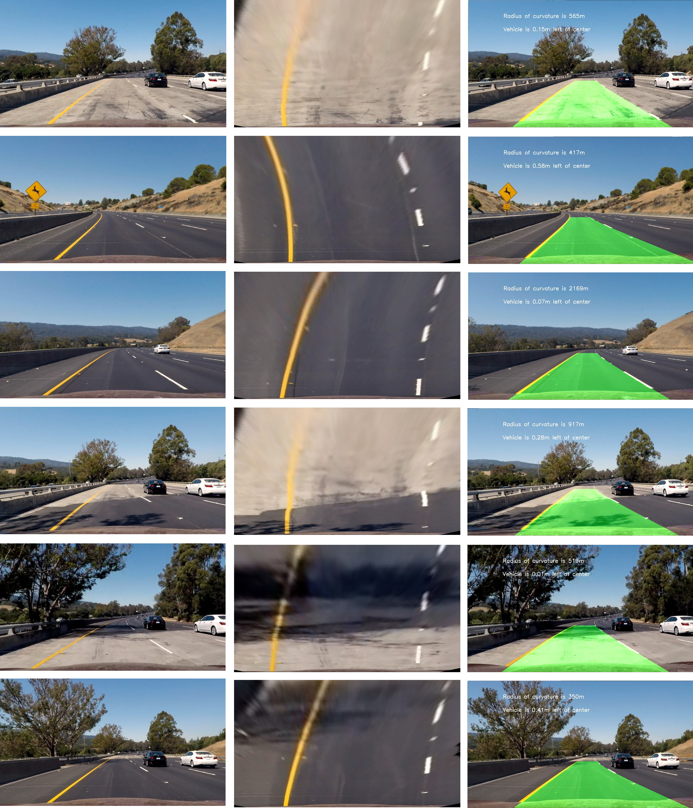

### Pipeline (video)

Based on a described pipeline I made tests on a exemplary video. After some fine tuning I obained good results, without serious flickering and without huge fitting lines variations. However, the resulting curvature sometimes varied too much. That's why I added averaging of this parametere  using weighted average over last 9 frames. 

Here's a [link to my video result](./project_video_output.mp4)

### Discussion

In my opinion there were 2 crucial steps to fine tune: obtaining good binary threshold image and defining `src` and `dst` points in order to properly transform images. Binary thresholding and transform points variations was tested on many more examples than initially provided here in order to generalize well and to prevent from detecting shadows or neighboring lanes.  The results seem to ok in general, but in the real world we would probably need to define `src` and `dst` parameters in smarter way and measure meters/pixel to obtain more accurate curvature and center shift. I made a big simple mistake in the first stage of development - I forgot that images are read in BGR format instead of RGB by OpenCV. This caused unexpected errors and confusion but finally I corrected this and got stable and nice results both processing images and video.
